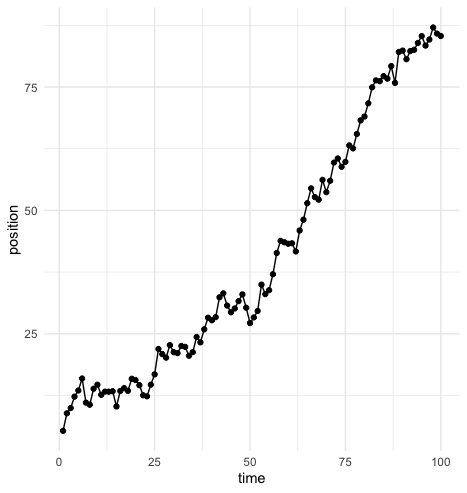

<!-- README.md is generated from README.Rmd. Please edit that file -->

```{r, echo = FALSE}
knitr::opts_chunk$set(
  collapse = TRUE,
  comment = "#>",
  fig.path = "README-"
)
# Please put your title here to include it in the file below.
Title <- "Title of your paper goes here"
```

# simplerc

[](https://mybinder.org/v2/gh///master?urlpath=rstudio)

Random walks are stochastic models that describe a path through a mathematical space that consists of random, discrete steps. This compendium contains simple functions that can be used to simulate, plot, or fit one-dimensional random walks.

### How to cite

Please cite this compendium as:

> Randomwalk Enthusiast, (`r format(Sys.Date(), "%Y")`). _Introduction to random walks_. Accessed `r format(Sys.Date(), "%d %b %Y")`. Online at <https://doi.org/xxx/xxx>

## How to install

This research compendium has been developed using the statistical programming
language R. To work with the compendium, you will need
installed on your computer the [R software](https://cloud.r-project.org/)
itself and optionally [RStudio Desktop](https://rstudio.com/products/rstudio/download/).

You can download the compendium as a zip from from this URL:
[simplerc](https://github.com/ggsun/simplerc). After unzipping:
- open the `.Rproj` file in RStudio
- run `devtools::install()` to ensure you have the packages this analysis depends on (also listed in the
[DESCRIPTION](/DESCRIPTION) file).

## How to use

The `simulate_walk()` function takes as arguments the number of steps `t`, and the mean (`mu`) and standard deviation (`sigma`) of the normal distribution that each step size is drawn from, and returns a series of values that represent a random walk in a one-dimensional space. Example code is shown below:
```
t <- 100
mu <- 0.5
sigma <- 2

walk <- simulate_walk(t, mu, sigma)
```

The `plot_walk()` function can be used to plot a simulated walk:
```
plot_walk(walk)
```



The `fit_walk()` function takes a simulated walk as an argument, and estimates the parameters (`mu` and `sigma`) of the normal distributions that were used to simulate the random walk.
```
params <- fit_walk(walk)
```

## Contents

The **analysis** directory contains:

  - [:file\_folder: paper](/analysis/paper): R Markdown source document
    for manuscript. Includes code to reproduce the figures and tables
    generated by the analysis. It also has a rendered version,
    `paper.docx`, suitable for reading (the code is replaced by figures
    and tables in this file)
  - [:file\_folder: data](/analysis/data): Data used in the analysis.
  - [:file\_folder: figures](/analysis/figures): Plots and other
    illustrations
  - [:file\_folder:
    supplementary-materials](/analysis/supplementary-materials):
    Supplementary materials including notes and other documents
    prepared and collected during the analysis.

### Licenses

**Text and figures :**  [CC-BY-4.0](http://creativecommons.org/licenses/by/4.0/)

**Code :** See the [DESCRIPTION](DESCRIPTION) file

**Data :** [CC-0](http://creativecommons.org/publicdomain/zero/1.0/) attribution requested in reuse

### Contributions

We welcome contributions from everyone. Before you get started, please see our [contributor guidelines](CONTRIBUTING.md). Please note that this project is released with a [Contributor Code of Conduct](CONDUCT.md). By participating in this project you agree to abide by its terms.

