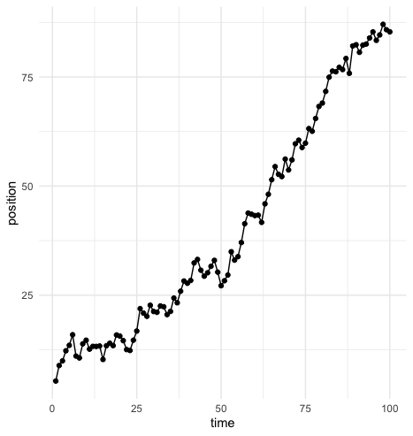

<!-- README.md is generated from README.Rmd. Please edit that file -->

# simplerc

Random walks are stochastic models that describe a path through a
mathematical space that consists of random, discrete steps. This
compendium contains simple functions that can be used to simulate, plot,
or fit one-dimensional random walks.

### How to cite

Please cite this compendium as:

> Randomwalk Enthusiast, (2021). *Introduction to random walks*.
> Accessed 09 Dec 2021. Online at <https://doi.org/xxx/xxx>

## How to install

This research compendium has been developed using the statistical
programming language R. To work with the compendium, you will need
installed on your computer the [R
software](https://cloud.r-project.org/) itself and optionally [RStudio
Desktop](https://rstudio.com/products/rstudio/download/).

You can download the compendium as a zip from from this URL:
[simplerc](https://github.com/ggsun/simplerc). After unzipping: - open
the `.Rproj` file in RStudio - run `devtools::install()` to ensure you
have the packages this analysis depends on (also listed in the
[DESCRIPTION](/DESCRIPTION) file).

## How to use

The `simulate_walk()` function takes as arguments the number of steps
`t`, and the mean (`mu`) and standard deviation (`sigma`) of the normal
distribution that each step size is drawn from, and returns a series of
values that represent a random walk in a one-dimensional space. Example
code is shown below:

    t <- 100
    mu <- 0.5
    sigma <- 2

    walk <- simulate_walk(t, mu, sigma)

The `plot_walk()` function can be used to plot a simulated walk:

    plot_walk(walk)

The `fit_walk()` function takes a simulated walk as an argument, and
estimates the parameters (`mu` and `sigma`) of the normal distributions
that were used to simulate the random walk.

    params <- fit_walk(walk)

## Contents

The **analysis** directory contains:

-   [:file_folder: paper](/analysis/paper): R Markdown source document
    for manuscript. Includes code to reproduce the figures and tables
    generated by the analysis. It also has a rendered version,
    `paper.docx`, suitable for reading (the code is replaced by figures
    and tables in this file)
-   [:file_folder: data](/analysis/data): Data used in the analysis.
-   [:file_folder: figures](/analysis/figures): Plots and other
    illustrations
-   [:file_folder:
    supplementary-materials](/analysis/supplementary-materials):
    Supplementary materials including notes and other documents prepared
    and collected during the analysis.

### Licenses

**Text and figures :**
[CC-BY-4.0](http://creativecommons.org/licenses/by/4.0/)

**Code :** See the [DESCRIPTION](DESCRIPTION) file

**Data :** [CC-0](http://creativecommons.org/publicdomain/zero/1.0/)
attribution requested in reuse

### Contributions

We welcome contributions from everyone. Before you get started, please
see our [contributor guidelines](CONTRIBUTING.md). Please note that this
project is released with a [Contributor Code of Conduct](CONDUCT.md). By
participating in this project you agree to abide by its terms.
